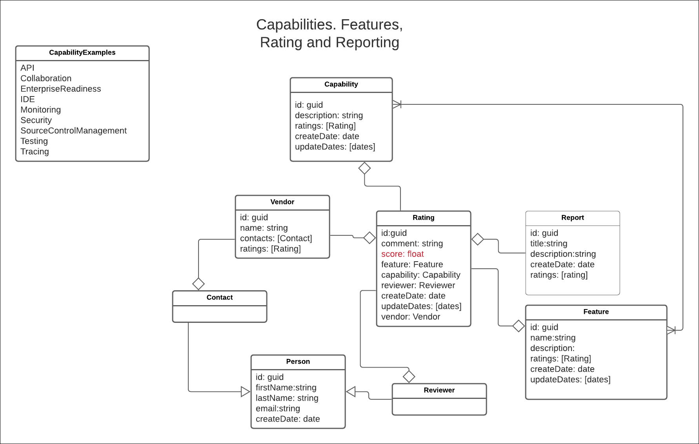
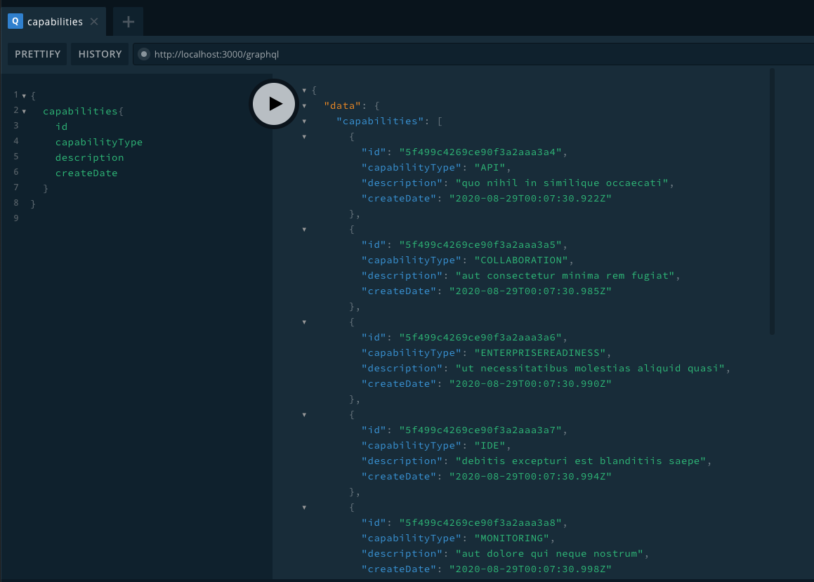

# Cory
A WIP project for implementing objective core capabilities analysis and rating of software services

## Understading the Cory Data Model




DETAILS TO BE PROVIDED

Features and Reports have yet to be implemented

## Installation
In order to run Cory on your local machine you must have Docker installed. The installation instructions are [here](https://docs.docker.com/get-docker/).

**Step 1:** Clone the repo to your local filesystem

`git clone https://github.com/reselbobasg/cory.git`

**Step 2:** Navigate to the `cory` directory

`cd cory`

**Step 3:** Install the dependencies

`npm install`

## Seeding the Data

Once `cory` is instlled on your local machine, you need to create the an instance of MongodDB running in a container. 

**Step 1:** To create the local MongodDB in a container run the follow ing shell script:

`sh create_local_db.sh`

**Step 2:** Inject seed data into the MongoDB database.

`npm run-script seed`


## Running the API

The Cory API is programmed in GraphQL. Cory ships with a GraphQL server. The GraphQL server publishes a webpage named GraphQL Playground. GraphQL playground is an online utility that allows you to execute queries and mutations against th Cory API.

**Step 1:** Start the Cory API server

`npm run-script start_server`

You will get the following response

`GraphQL is now running on http://localhost:3000/graphql`

In your browser, go to the URL:

`http://localhost:3000/graphql`

GraphQL Playground will appear.



**Step 2:** Execute a test query against the API. In the left query pane of the GraphQL Playground enter the following query

```
{
  capabilities{
    id
    capabilityType
    description
    createDate
  }
}

```

You will get output similar to the following:

```
{
  "data": {
    "capabilities": [
      {
        "id": "5f499c4269ce90f3a2aaa3a4",
        "capabilityType": "API",
        "description": "quo nihil in similique occaecati",
        "createDate": "2020-08-29T00:07:30.922Z"
      },
      {
        "id": "5f499c4269ce90f3a2aaa3a5",
        "capabilityType": "COLLABORATION",
        "description": "aut consectetur minima rem fugiat",
        "createDate": "2020-08-29T00:07:30.985Z"
      },
      {
        "id": "5f499c4269ce90f3a2aaa3a6",
        "capabilityType": "ENTERPRISEREADINESS",
        "description": "ut necessitatibus molestias aliquid quasi",
        "createDate": "2020-08-29T00:07:30.990Z"
      },
      {
        "id": "5f499c4269ce90f3a2aaa3a7",
        "capabilityType": "IDE",
        "description": "debitis excepturi est blanditiis saepe",
        "createDate": "2020-08-29T00:07:30.994Z"
      },
      {
        "id": "5f499c4269ce90f3a2aaa3a8",
        "capabilityType": "MONITORING",
        "description": "aut dolore qui neque nostrum",
        "createDate": "2020-08-29T00:07:30.998Z"
      },
      {
        "id": "5f499c4369ce90f3a2aaa3a9",
        "capabilityType": "SECURITY",
        "description": "tenetur voluptatem vero quia suscipit",
        "createDate": "2020-08-29T00:07:31.002Z"
      },
      {
        "id": "5f499c4369ce90f3a2aaa3aa",
        "capabilityType": "SOURCECONTROLMANAGEMENT",
        "description": "aut aut est cum quis",
        "createDate": "2020-08-29T00:07:31.006Z"
      },
      {
        "id": "5f499c4369ce90f3a2aaa3ab",
        "capabilityType": "TESTING",
        "description": "labore fuga autem distinctio distinctio",
        "createDate": "2020-08-29T00:07:31.013Z"
      },
      {
        "id": "5f499c4369ce90f3a2aaa3ac",
        "capabilityType": "TRACING",
        "description": "blanditiis natus illum perferendis fugit",
        "createDate": "2020-08-29T00:07:31.018Z"
      }
    ]
  }
}

```